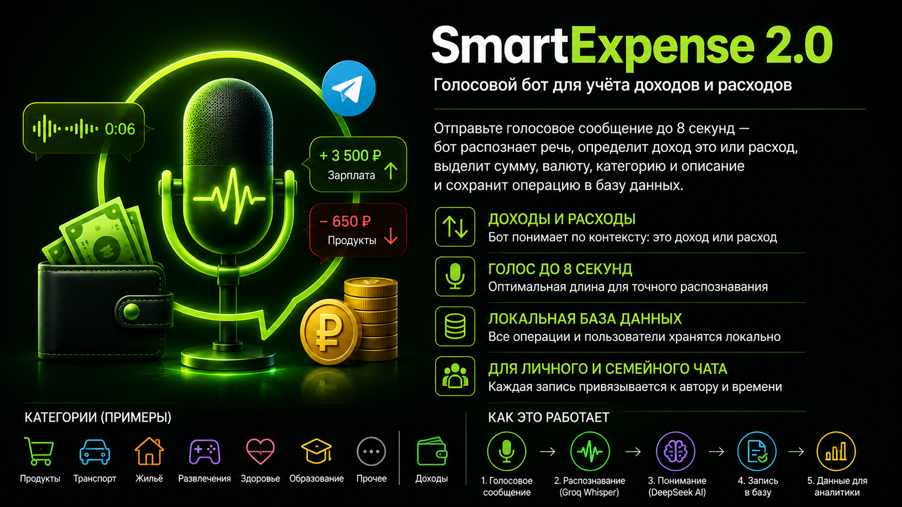

# Voice Budget Bot

Telegram-бот для быстрого голосового учета личного и семейного бюджета.

<p align="center">
  
</p>

Пользователь отправляет короткое голосовое сообщение с одной операцией. Бот
проверяет длительность, нормализует аудио через FFmpeg, распознает речь через
Groq Whisper, извлекает структуру операции через DeepSeek и сохраняет результат
в локальную SQLite-базу.

## Project origin

This project is based on SmartExpenseBot by Botir Bakhtiyarov and is distributed
under the MIT License.

The current fork contains a substantial redesign focused on voice-only private
and family budget tracking, Groq speech recognition, DeepSeek-based
income/expense extraction and local storage.

## MVP Features

- личные чаты и явно разрешенные семейные группы;
- только Telegram voice до 8 секунд;
- Groq `whisper-large-v3` для speech-to-text;
- DeepSeek JSON extraction для `EXPENSE` и `INCOME`;
- суммы хранятся как integer minor units, без float;
- SQLite-таблицы `users`, `chats`, `transactions`, `processing_events`;
- защита от дублей по `telegram_chat_id + telegram_message_id`;
- временные аудиофайлы удаляются после обработки;
- Docker Compose deployment.

## Bot Assets

- `assets/bot-icon.png` is the source icon for the Telegram bot avatar.
- `assets/readme-description.png` is the README overview image.

## Configuration

Copy `.env.example` to `.env` and fill secrets outside Git:

```dotenv
BOT_TOKEN=
GROQ_API_KEY=
DEEPSEEK_API_KEY=
ALLOWED_CHAT_IDS=
```

When `ALLOWED_CHAT_IDS` is empty, private chats are allowed and groups are
ignored. For group use, add the group ID, for example:

```dotenv
ALLOWED_CHAT_IDS=123456789,-1001234567890
```

## Run

```bash
docker compose up -d --build
```

For local tests:

```bash
python -m venv .venv
. .venv/bin/activate
pip install -r requirements.txt
pytest
```

## Privacy

Audio is sent only to Groq for transcription. The transcript is sent to
DeepSeek for structured extraction. API keys, transcripts, amounts,
descriptions and raw model responses are not written to logs.
